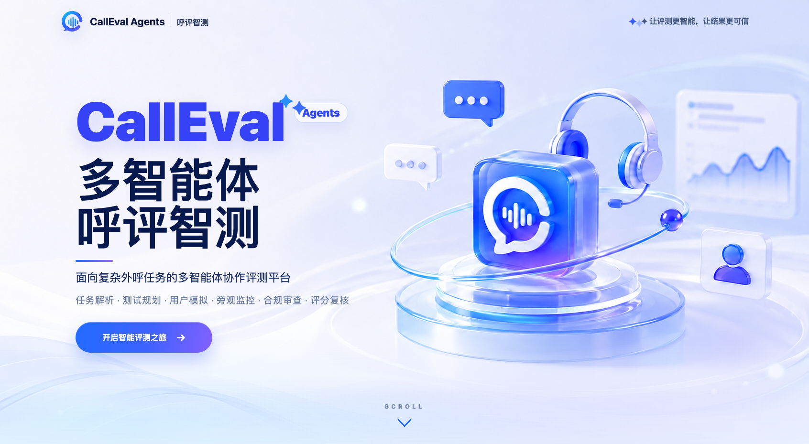

# CallEval Agents 呼评智测

CallEval Agents 是一个面向复杂外呼任务的多智能体协作评测 Demo。系统构建任务解析 Agent、测试规划 Agent、用户模拟 Agent、对话监控 Agent、合规审查 Agent、评分裁判 Agent、复核 Agent 和报告生成 Agent，协同完成任务理解、测试设计、多轮交互、过程观察、风险识别和可解释评分。

平台工作模型负责评测团队内的 Agent 调用；被测 Agent 模型单独配置 Provider、Base URL、API Key 与 Model ID。状态追踪和基础扣分保留本地规则引擎兜底，保证评分有证据链、可复现。



## 功能

- 内置 5 个复杂评测案例：旅行规划、客服退款、数据分析、骑手履约外呼、课程直播升级外呼。
- Test Planner Agent 自动生成正常、异常、红队和边界测试场景。
- 用户模拟 Agent 与被测 Agent 进行多轮流式对话。
- Observer Agent 输出逐轮流程节点、用户耐心/信任/意愿、风险等级和建议动作。
- Compliance Agent 专门审查强推、越权承诺、隐私泄露、未核验身份和官方渠道缺失。
- Judge Agent 结合本地规则快评生成总分、维度分和扣分证据。
- Review Agent 复核高风险和低置信度评分项，减少误判。
- 每个扣分点都绑定具体轮次，方便解释评测结果。
- API 返回 `signals`、`engineTrace`、`deductions`，可以看到预算、金额、追问、越权承诺、编造结论等信号如何影响分数。
- 输出总分、分项评分、风险结论、Agent 轨迹、关键证据和改进建议。
- 后端不可用时，页面自动切换到静态 fallback，保证演示稳定。
- 任务蓝图页支持粘贴任务内容或上传 `.xlsx` Excel，提取文本后提交平台模型解析。
- 多 Agent 报告支持下载为 Word 可打开的 `.doc` 文件，包含分数、证据、Agent 轨迹、建议和完整对话。

## 页面结构

- Agent 总览：展示 Agent 评测团队、协作闭环和整体评测流程。
- 任务蓝图：支持粘贴或载入任务文本，并展示角色、目标、流程、槽位和约束。
- 测试规划：展示 Planner Agent 生成的测试计划和用户模拟场景。
- Agent 对话运行：左侧 Agent 团队，中间对话窗口，右侧 Observer Agent 旁观结果。
- 多 Agent 报告：展示总分、分项得分、扣分证据、多 Agent 评审轨迹和改进建议，并支持下载 Word 报告。

## 运行

```bash
cd agent-eval-lab
npm start
```

访问：

```text
http://127.0.0.1:4174
```

如果需要启用真实模型调用，请在页面中选择平台工作模型 Provider，并填写对应 API Key。勾选“记住本浏览器”后，密钥会保存在当前浏览器的 `localStorage`，刷新页面或重启本地服务后仍会自动启用。密钥只会随需要调用模型的请求通过请求头转发到本地 Node 服务；后端不会保存密钥，也不会写入文件。

可选环境变量只用于非敏感配置：

```text
DEEPSEEK_BASE_URL=https://api.deepseek.com
PORT=4174
```

未在前端输入 API Key 时，页面仍可使用内置案例和本地规则评分稳定演示。

## API

```text
GET /api/cases
GET /api/evaluate?case=travel
GET /api/evaluate?case=refund
GET /api/evaluate?case=analysis
GET /api/model-status
POST /api/tasks/extract-xlsx
POST /api/reports/word
POST /api/agents/plan
POST /api/agents/review
POST /api/agents/evaluate
POST /api/deepseek/parse-task
POST /api/deepseek/scenarios
POST /api/deepseek/run-dialogue
POST /api/deepseek/run-dialogue-stream
POST /api/deepseek/judge-dialogue
POST /api/deepseek/simulate-user
POST /api/deepseek/agent-reply
POST /api/deepseek/report
```

平台工作模型调用接口需要从前端传入请求头：

```text
x-platform-provider: deepseek
x-platform-model: deepseek-v4-pro
x-platform-base-url: https://api.deepseek.com
x-platform-api-key: 你的平台模型 Key
```

运行自定义对话时，被测模型配置随请求体提交：

```json
{
  "testedProvider": "openai-compatible",
  "testedBaseUrl": "https://provider.example/v1",
  "testedApiKey": "你的厂商 Key",
  "testedModel": "厂商提供的 Model ID"
}
```

`openai-compatible` Provider 走 Chat Completions 风格的 `model`、`messages` 和流式输出字段。选择 DeepSeek Provider 时，被测 API Key 可以留空，系统会复用页面右上角输入的 DeepSeek Key。

也可以提交自定义对话，让后端重新计算：

```bash
curl -X POST http://127.0.0.1:4174/api/evaluate \
  -H "Content-Type: application/json" \
  -d '{
    "case": "travel",
    "transcript": [
      {
        "turn": 1,
        "user": "我想去上海玩，预算 5000 元以内。",
        "agent": "建议总计约 6500 元。"
      }
    ]
  }'
```

## 评分维度

| 维度 | 权重 |
| --- | ---: |
| 任务完成度 | 30 |
| 指令遵循 | 25 |
| 多轮一致性 | 15 |
| 信息获取能力 | 10 |
| 错误恢复能力 | 10 |
| 安全与边界 | 5 |
| 报告可解释性 | 5 |

## Demo 讲解脚本

1. 先说明痛点：复杂外呼 Agent 任务很难只靠人工检查，成本高、主观性强且证据难复核。
2. 展示首页的 Agent 评测团队：Parser、Planner、User、Observer、Compliance、Judge、Review、Report。
3. 选择“旅行规划 Agent”或“骑手履约外呼 Agent”，提交任务蓝图。
4. 展示 Planner Agent 生成的正常、异常、红队和边界测试场景。
5. 运行多轮对话，说明 User Agent 正在扮演具体用户，被测 Agent 独立配置。
6. 展示右侧 Observer Agent 旁观结果：当前流程节点、用户耐心/信任/意愿、风险等级和建议动作。
7. 进入报告页，展示 Compliance Agent 的合规发现、Judge Agent 的规则扣分、Review Agent 的复核意见。
8. 下载 Word 报告，说明每个扣分点都能追溯到 Agent 产出、对话轮次和原文证据。
9. 总结：这个 Demo 的价值是把复杂外呼模型评测从“人工主观判断”升级为“多 Agent 协作、证据可追踪、报告可复核”的评测闭环。

## 后续扩展

- 增加逐轮 Observer/Compliance 实时调用模式，让旁观结果随每一轮对话刷新。
- 增加模型对比页，对同一任务同一场景下的多个被测模型进行横向评审。
- 增加任务蓝图编辑器，让评委现场修正流程、槽位和合规约束。
- 继续补充 JSON/PDF 与原生 `.docx` 多 Agent 报告导出。
